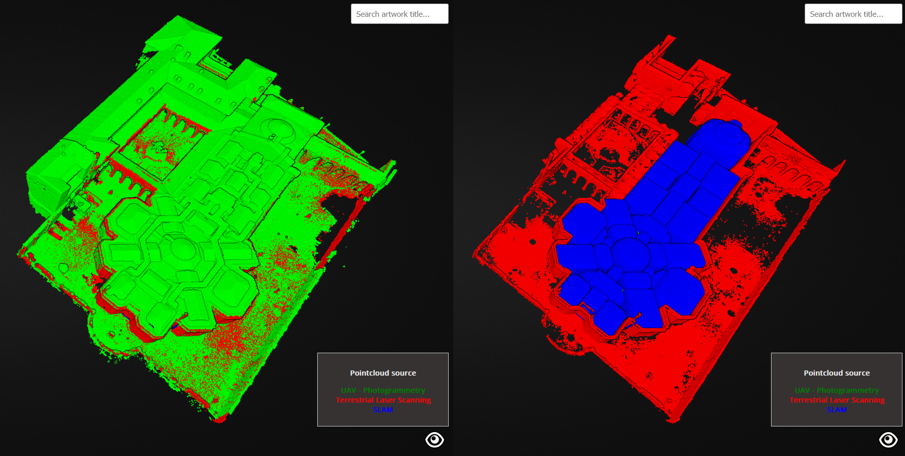

# riccio3di
A web app for exploring in 3D an art exhibition based on Potree JS.

A working example can be found on the [LabMGF@PoliMi](https://labmgf.dica.polimi.it/pujob/riccio3di/) website.

")

## **Table of content** 📋

- [How to install and run](#how-to-install-and-run-⚙)
- [Features](#features-💡)
- [License](#license)
- [Performance](#performance-💻)
- [Credits](#credits-👥)
- [How to contribute](#how-to-contribute-❓)
- [References](#references-📚)

## **How to install and run** ⚙

Make sure you have the following installed and working in order to reproduce the project. You can view detailed installation guidelines within the following links:
* [Xampp / Apache server](https://www.apachefriends.org/index.html)
* [Github to clone project](https://git-scm.com/downloads)

Once you cloned this repository, make sure that it is located inside the *xampp/htdocs* directory. The web app will then be accessible by connecting to the url *localhost/riccio3di/*.

In order to enable the db connection for annotations loading, install PostgreSQL and create a new database containing a table for artworks information. For the Ricci Oddi case study, PostgreSQL 16.1 version has been used.
Then, fix the connection credentials in index.php according to your case.

## **License**

For continuity sake, this project carries the same license as the original Potree project. More information can be found in the [LICENSE](https://github.com/Tars4815/riccio3di/blob/main/LICENCE) file.

## **Features** 💡

**Custom welcome page**

<video width="320" height="240" controls>
  <source src="assets/video/welcome-page.mp4" type="video/mp4">
</video>

**3D scene exploration**

<video width="320" height="240" controls>
  <source src="assets/video/3d-scene-exploration.mp4" type="video/mp4">
</video>

**Point cloud source legend**

<video width="320" height="240" controls>
  <source src="assets/video/point-cloud-source-legend.mp4" type="video/mp4">
</video>

**Search bar and info panel**

<video width="320" height="240" controls>
  <source src="assets/video/search-bar-info-panel.mp4" type="video/mp4">
</video>

**Indoor floor plan navigation**

<video width="320" height="240" controls>
  <source src="assets/video/indoor-floor-plan-navigation.mp4" type="video/mp4">
</video>

**Database-connected annotations**

<video width="320" height="240" controls>
  <source src="assets/video/database-connected-annotations.mp4" type="video/mp4">
</video>

## **Performance** 💻
Examples work best and with Google Chrome and Firefox.

## **Credits** 👥

The project has been originally developed by **LAB2R** (Laboratory of Survey and Representation) and **LabMGF** (Geodetic and Photogrammetric Laboratory) coordinated by Professor [Livio Pinto](https://www.researchgate.net/profile/Livio-Pinto) at Politecnico di Milano - Piacenza campus.

The in situ survey was part of the laboratories for the [**RELIEF TECHNIQUE AND 3D MODELING FOR THE ARCHITECTURE**](https://www11.ceda.polimi.it/schedaincarico/schedaincarico/controller/scheda_pubblica/SchedaPublic.do?&evn_default=evento&c_classe=735710&polij_device_category=DESKTOP&__pj0=0&__pj1=93e89e7f2db93a52f4de53beb4e38ea2) course from the Bachelor of Science Degree in Architectural Design. Drone surveys and laser scanner acquisitions were conducted and pre-processed by [Federico Barbieri](https://www.linkedin.com/in/federico-barbieri-8006a0228/), [Rebecca Fascia](https://www.linkedin.com/in/rebecca-fascia-a82b10223/) and [Francesco Ioli](https://www.linkedin.com/in/francesco-ioli-640061160/)

The collected data were first processed within the research thesis project entitled *Galleria Ricci Oddi: Indagine storica - rilievo e rappresentazione del complesso architettonico* by Gaia Castelli.

The digital twin platform implementation was carried by [Federica Gaspari](https://www.linkedin.com/in/federicagaspari/).

## **How to contribute** ❓

if you are willing to contribute or test the template for several applications and report a bug or suggest new features:
1. Fork this repository
2. Clone your fork
3. Create a new branch
4. Make desired changes to the code and commit them
5. Push changes to your GitHub repository
6. Open a pull request

## References 📚

* Fascia, R., Barbieri, F., Gaspari, F., Ioli, F., and Pinto, L.: From 3D survey to digital reality of a complex architecture: a digital workflow for cultural heritage promotion, *Int. Arch. Photogramm. Remote Sens. Spatial Inf. Sci.*, XLVIII-2/W4-2024, 205–212, https://doi.org/10.5194/isprs-archives-XLVIII-2-W4-2024-205-2024, 2024

